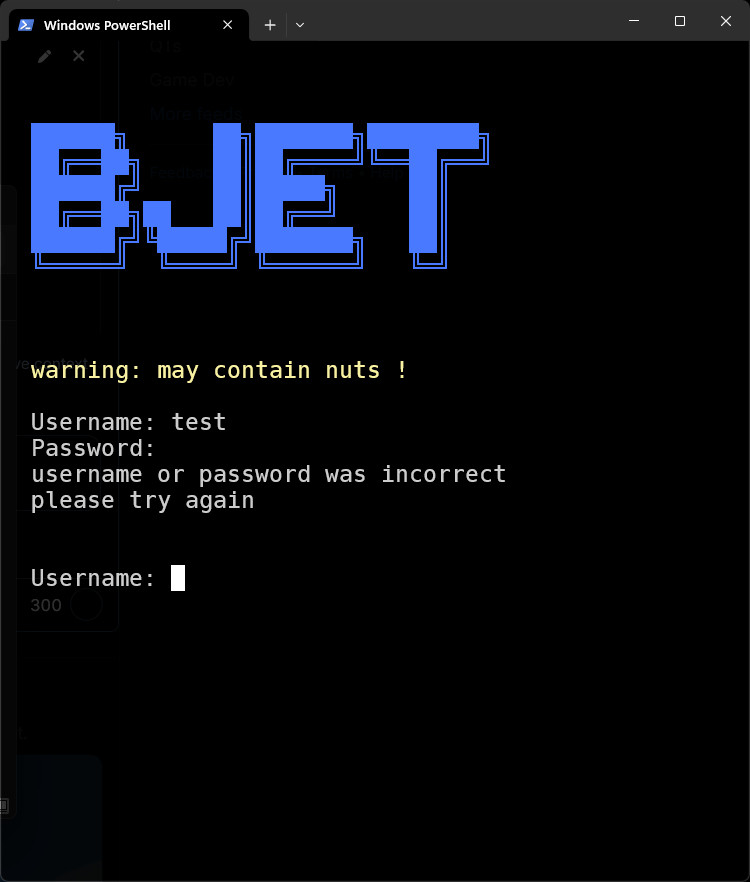

# BJET
a simple script that allows for command line interaction with a bluesky account including logging in, storing login details, and submitting posts.

## features

- login to bluesky
- save bluesky login details
- edit bluesky login details
- post on bluesky

## github

check out the [GitHub page](https://github.com/qtPyDev/bsky-post) for the ability to submit issues and manually install the addon.
